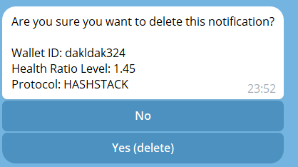
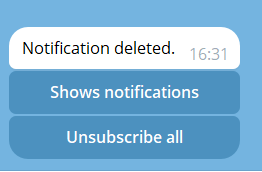

# Notification Bot

This is a Telegram bot built using the aiogram library for Python. The bot allows users to subscribe to notifications and manage them through a menu-based interface. Users can view their current notifications, delete specific notifications, or unsubscribe from all notifications.

## Features

- Subscribe to notifications by sending the `/start` command with a deep link
- View a list of current notifications
- Delete individual notifications
- Unsubscribe from all notifications
- Pagination for navigating through multiple notifications

# Installation

## Telegram Bot Setup

To receive alerts via Telegram, follow these steps to set up your Telegram bot:

## How to get Telegram Token:

### 1. Find BotFather:
To get a token and create a chatbot, you need to find a bot named BotFather in the Telegram messenger.


### 2. Create Your Bot:
In the BotFather bot, you need to write the command `/newbot`. After that, BotFather will prompt you to enter:
- the name of your bot that users will see;
- uri of the bot, i.e. the link to the bot that will be added to the link https://t.me/{youruri}.


### 3. Retrieve Your Token:
After the data is entered and it has passed validation, BotFather will respond with a message that will contain the API token of the created bot.


### 4. Access Your Bot:
Done! At this moment, the bot has already been created, and it is possible to subscribe to it by finding it in Telegram search or by following the link. 

# Setup

### 1. Clone git repository

```bash
git clone https://github.com/CarmineOptions/derisk-research.git
```

### 2. Navigate to the `shared/telegram_app` Directory


```bash
cd shared/telegram_app
```

### 3. Set up `.env` file

Create `.env` file or just rename `.env.example` --> `.env`

```bash
mv .env.example .env
```


1. Install the required dependencies:

    Current work directory is telegram_app
    ```bash
    python -m venv venv
    source FULL_PATH/derisk-research/apps/shared/telegram/venv/bin/activate
    pip install poetry
    poetry install
    ```

2. Set up the database and configure the necessary environment variables

```bash
DB_NAME=#
DB_USER=#
DB_PASSWORD=#
DB_HOST=db
DB_PORT=#
IP_INFO_TOKEN=#
TELEGRAM_TOKEN= # token telegram from botfather
REDIS_HOST=redis
REDIS_PORT=6379
DATA_HANDLER_URL=# url to data handler
```

3. Run the bot:

```bash
python -m telegram
```

## Usage

### Subscribing to Notifications

To subscribe to notifications, send the `/start` command followed by a deep link to the bot. This will register your Telegram ID in the database and allow you to receive notifications.


### Accessing the Main Menu

To access the main menu, either click the "Go to menu" button or send the `/menu` command to the bot.


### Viewing Notifications

From the main menu, click the "Shows notifications" button to view your current notifications. If you have multiple notifications, pagination buttons will be displayed to navigate through them.


### Deleting a Notification

To delete a specific notification, click the "Delete" button while viewing the notification details.



After clicking delete



### Unsubscribing from All Notifications

To unsubscribe from all notifications, click the "Unsubscribe all" button in the main menu and confirm your action.


After clicking Unsubscribe all

