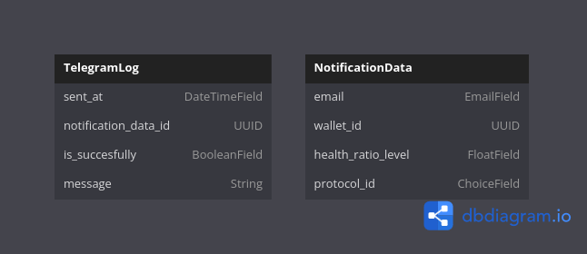
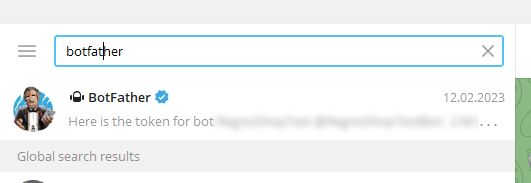
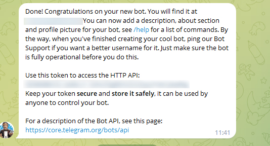

# DeRisk Alert

# How it works:

This section provides an overview of how the DeRisk Alert system operates.


### Demo Video
### `Here is a demo video of how it works` [Click](https://drive.google.com/file/d/1TYwEx6PWvPerrJSfiePQzZEtbj53Yn_g/view?usp=sharing)

### Notification System
### When the `health ratio` is appropriate to the value you 
### have set you will be notified via `Telegram`


# Database Structure:


This diagram shows the ordering and structure of the database for the DeRisk Alert system:


## Requirements
 - python3.11 
 - poetry
 - docker
 - docker-compose

## Telegram Bot Setup

To receive alerts via Telegram, follow these steps to set up your Telegram bot:

## How to get Telegram Token:

### 1. Find BotFather:
To get a token and create a chatbot, you need to find a bot named BotFather in the Telegram messenger.


### 2. Create Your Bot:
In the BotFather bot, you need to write the command `/newbot`. After that, BotFather will prompt you to enter:
- the name of your bot that users will see;
- uri of the bot, i.e. the link to the bot that will be added to the link https://t.me/{youruri}.


### 3. Retrieve Your Token:
After the data is entered and it has passed validation, BotFather will respond with a message that will contain the API token of the created bot.


### 4. Access Your Bot:
Done! At this moment, the bot has already been created, and it is possible to subscribe to it by finding it in Telegram search or by following the link. 

# Setup

### 1. Clone git repository

```bash
git clone https://github.com/CarmineOptions/derisk-research.git
```

### 2. Navigate to the `web_app/` Directory


```bash
cd web_app 
```

### 3. Set up `.env` file

Create `.env` file or just rename `.env.example` --> `.env`

```bash
mv .env.example .env
```

### 4. Provide all environment variables needed

```bash
DB_NAME=#
DB_USER=#
DB_PASSWORD=#
DB_HOST=db
DB_PORT=#
IP_INFO_TOKEN=#
TELEGRAM_TOKEN= # token telegram from botfather
REDIS_HOST=redis
REDIS_PORT=6379
DATA_HANDLER_URL=# url to data handler
```

### 5. Build your docker containers

```bash
docker-compose up -d --build
```

#### 6. Stop your containers

```bash
docker-compose down
```
