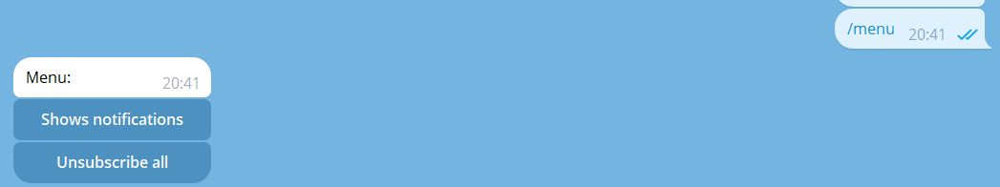
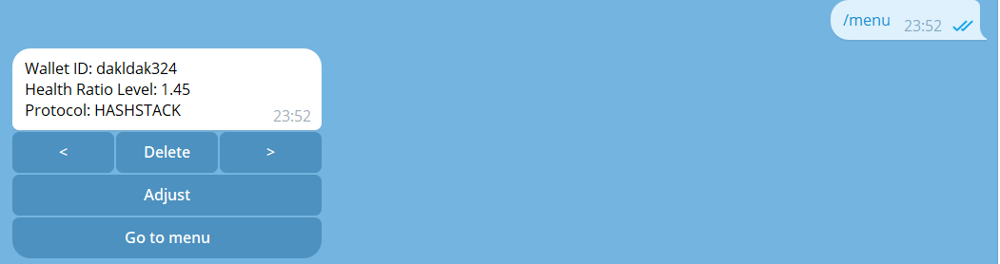
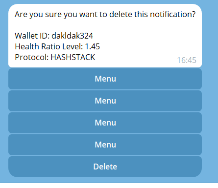
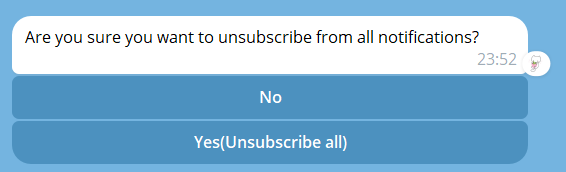
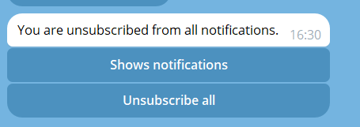

# Notification Bot

This is a Telegram bot built using the aiogram library for Python. The bot allows users to subscribe to notifications and manage them through a menu-based interface. Users can view their current notifications, delete specific notifications, or unsubscribe from all notifications.

## Features

- Subscribe to notifications by sending the `/start` command with a deep link
- View a list of current notifications
- Delete individual notifications
- Unsubscribe from all notifications
- Pagination for navigating through multiple notifications

## Installation

1. Install the required dependencies:

    Current work directory is web_app
    ```bash
    pip install poetry
    poetry install .
    ```

2. Set up the database and configure the necessary environment variables (views in web_app README).

3. Run the bot:

```bash
python -m telegram
```

## Usage

### Subscribing to Notifications

To subscribe to notifications, send the `/start` command followed by a deep link to the bot. This will register your Telegram ID in the database and allow you to receive notifications.


### Accessing the Main Menu

To access the main menu, either click the "Go to menu" button or send the `/menu` command to the bot.



### Viewing Notifications

From the main menu, click the "Shows notifications" button to view your current notifications. If you have multiple notifications, pagination buttons will be displayed to navigate through them.



### Deleting a Notification

To delete a specific notification, click the "Delete" button while viewing the notification details.



After clicking delete


### Unsubscribing from All Notifications

To unsubscribe from all notifications, click the "Unsubscribe all" button in the main menu and confirm your action.



After clicking Unsubscribe all

